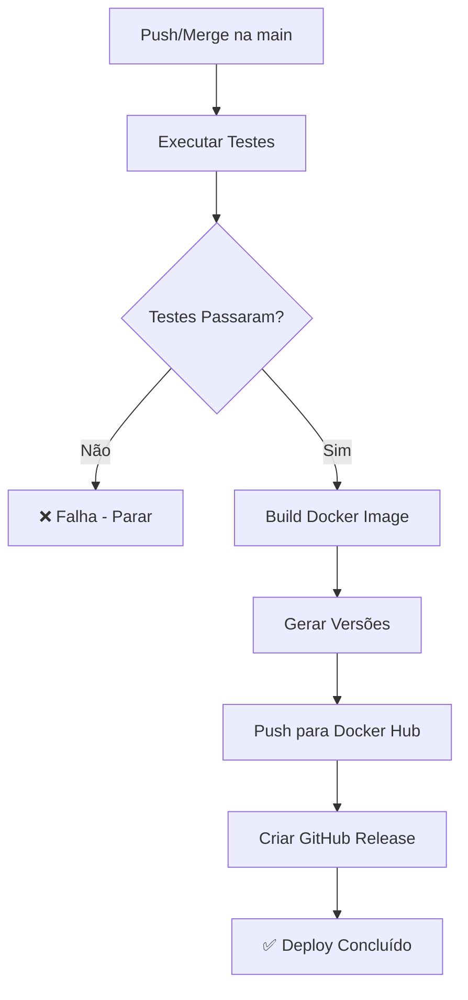

# GitHub Actions - Deploy Automático

Este documento explica como configurar o deploy automático para o projeto FinancesK usando GitHub Actions.

## ⚙️ Configuração Inicial

### 1. Secrets do GitHub

Configure os seguintes secrets no seu repositório GitHub:
- Vá em: `Settings` → `Secrets and variables` → `Actions`
- Adicione os seguintes secrets:

```
DOCKER_USERNAME: seu_usuario_dockerhub
DOCKER_PASSWORD: sua_senha_ou_token_dockerhub
```

### 2. Token do Docker Hub

Para maior segurança, recomenda-se usar um Access Token ao invés da senha:
1. Faça login no Docker Hub
2. Vá em `Account Settings` → `Security` → `Access Tokens`
3. Clique em `New Access Token`
4. Dê um nome (ex: "github-actions-financesk")
5. Selecione permissões: `Read & Write`
6. Use este token como `DOCKER_PASSWORD`

## 🚀 Como Funciona o Deploy

### Triggers (Gatilhos)
O deploy é acionado automaticamente quando:
- ✅ Push direto na branch `main`
- ✅ Pull Request mergeado na branch `main`

### Pipeline de Deploy

1. **Testes** 📋
   - Executa todos os testes do projeto
   - Gera relatório de testes
   - Falha se algum teste não passar

2. **Build & Deploy** 🔨
   - Constrói a imagem Docker
   - Gera versões automáticas
   - Publica no Docker Hub
   - Cria release no GitHub

### Versionamento Automático

O sistema gera 3 tags automaticamente:

```bash
# Sempre a versão mais recente
redmater/financesk:latest

# Versão com timestamp único
redmater/financesk:0.0.1.20241009143052

# Versão base do projeto
redmater/financesk:0.0.1
```

## 📦 Tags Geradas

### `latest`
- **Uso**: Produção
- **Descrição**: Sempre aponta para a versão mais recente
- **Docker Compose**: `image: redmater/financesk:latest`

### Versão com Timestamp
- **Formato**: `{versão}.{YYYYMMDDHHMMSS}`
- **Uso**: Rollback específico
- **Exemplo**: `redmater/financesk:0.0.1.20241009143052`

### Versão Base
- **Formato**: Versão do `build.gradle.kts`
- **Uso**: Referência da versão principal
- **Exemplo**: `redmater/financesk:0.0.1`

## 🔧 Configuração do Projeto

### build.gradle.kts
Certifique-se de que a versão esteja definida:
```kotlin
version = "0.0.1-SNAPSHOT"
```

### Docker Compose
Atualize o docker-compose-prod.yml para usar a imagem:
```yaml
services:
  app:
    image: redmater/financesk:latest
```

## 📊 Monitoramento

### GitHub Actions
- Visualize os deploys em: `Actions` tab do repositório
- Cada commit na main gera um novo workflow
- Logs detalhados de cada etapa

### Docker Hub
- Acesse: https://hub.docker.com/r/redmater/financesk
- Visualize todas as tags disponíveis
- Estatísticas de downloads

### Releases
- Cada deploy gera um release automático no GitHub
- Tags no formato: `v0.0.1.20241009143052`
- Informações do commit e links para Docker Hub

## 🚨 Troubleshooting

### Deploy Falhou
```bash
# Verificar logs no GitHub Actions
# Possíveis causas:
1. Testes falhando
2. Erro no build da aplicação
3. Credenciais Docker Hub incorretas
4. Dockerfile com problemas
```

### Corrigir e Re-deploy
```bash
# 1. Corrija o problema
# 2. Commit na main ou merge PR
# 3. GitHub Actions executará automaticamente
```

### Rollback Manual
```bash
# Use uma versão anterior específica
docker pull redmater/financesk:0.0.1.20241009120000
```

## 📋 Checklist de Configuração

- [ ] Secrets configurados no GitHub (DOCKER_USERNAME, DOCKER_PASSWORD)
- [ ] Access Token do Docker Hub criado
- [ ] Versão definida no build.gradle.kts
- [ ] Docker compose atualizado com a imagem correta
- [ ] Primeiro push/merge na main para testar

## 🔄 Workflow Completo



## 🎯 Próximos Passos

1. Configure os secrets no GitHub
2. Faça um commit de teste na main
3. Verifique o workflow em `Actions`
4. Confirme as imagens no Docker Hub
5. Atualize sua produção com `docker-compose pull`

---
**Nota**: O primeiro deploy pode demorar mais devido ao cache de dependências sendo construído.
